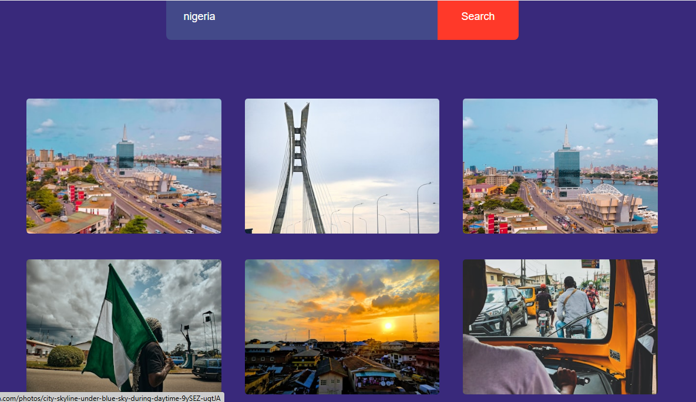

# Image Search Engine



A simple web app to search and browse images using the Unsplash API.

## Features

- Search for images by keyword
- View results in a responsive grid
- Load more images with the "Show More" button

## Getting Started

1. **Clone the repository:**
   ```sh
   git clone <your-repo-url>
   cd Image_Search_Engine_App
   ```

2. **Obtain an Unsplash API Access Key:**
   - Sign up at [Unsplash Developers](https://unsplash.com/developers)
   - Create a new application to get your access key

3. **Configure the Access Key:**
   - Replace the value of `accesskey` in [`script.js`](script.js) with your own Unsplash API key.

4. **Open the App:**
   - Open [`index.html`](index.html) in your browser.

## File Structure

- [`index.html`](index.html): Main HTML file
- [`style.css`](style.css): Stylesheet
- [`script.js`](script.js): JavaScript logic
- [`README.md`](README.md): Project documentation

## Usage

1. Enter a search term in the input box and click "Search".
2. Browse the images.
3. Click "Show More" to load additional images.

## Notes

- This app uses the Unsplash API and is for educational/demo purposes.
- Do **not** expose your production API key in public repositories.

## License

MIT


Yasss! 💅✨ Just dropped project 9/10 for my #10JSProjects challenge – an Image Search Engine powered by Unsplash!
One more to go and I’m DONE! 🔥
Go check it out and let me know what you think!
#JavaScript #WebDev #BaddieDev #WomenW